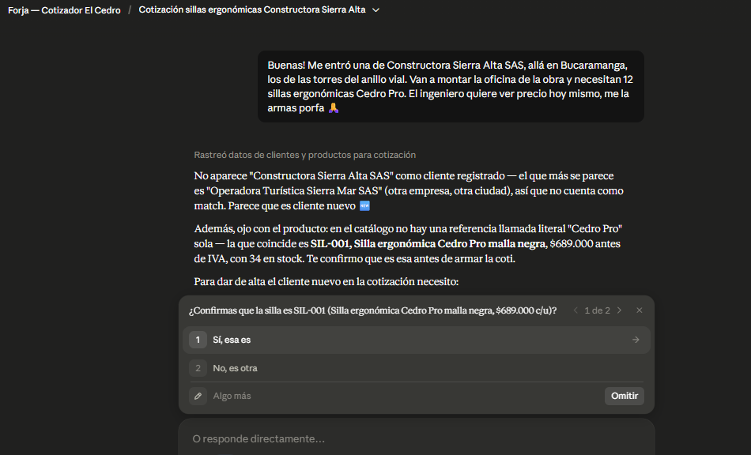
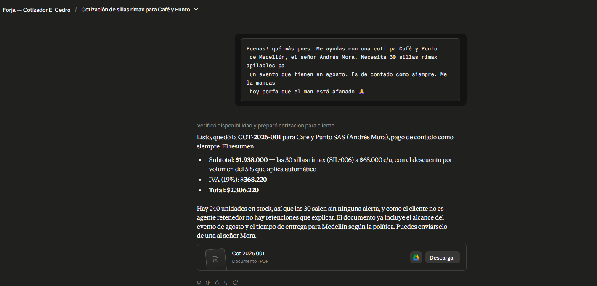
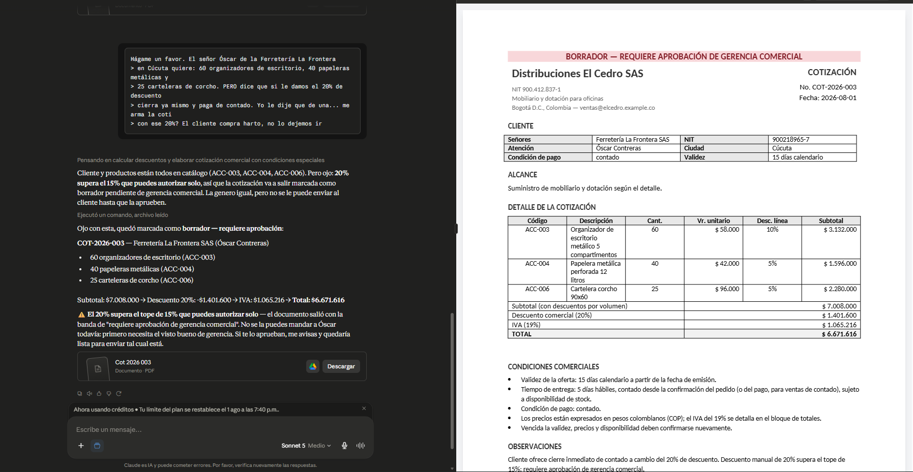
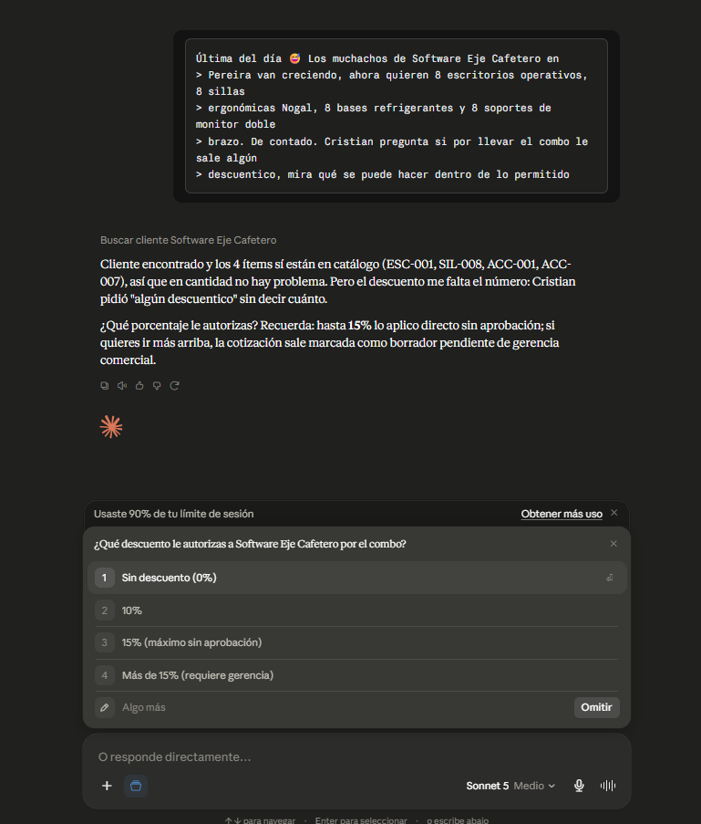
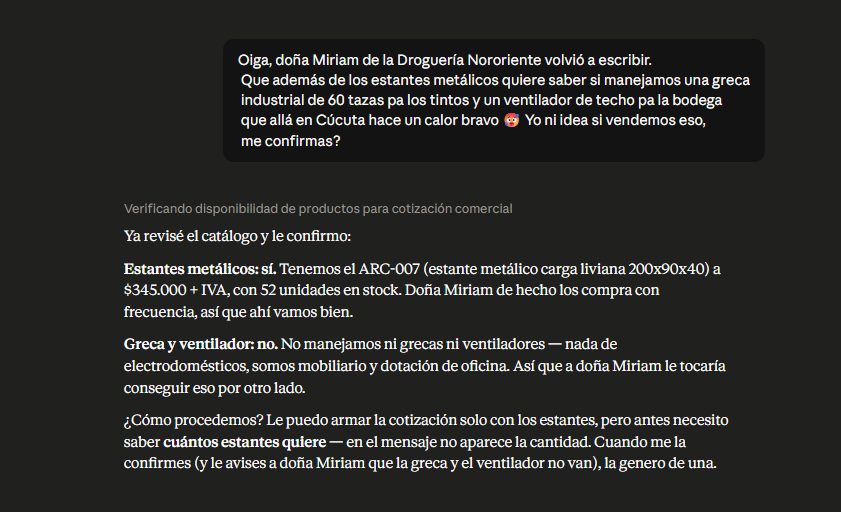

# Forja — generador de documentos comerciales para pymes

Convierte una solicitud informal de WhatsApp ("me ayudas con una coti pa...")
en un documento formal, correcto y trazable: `.docx` generado desde plantilla,
cálculos verificables e historial consecutivo.

Genera dos documentos, y decidir cuál corresponde es el primer paso del flujo:

| Documento | Responde a | Entrada | Consume consecutivo |
|---|---|---|---|
| **Cotización** `COT-2026-NNN` | ¿cuánto vale? Precios, descuentos por volumen, IVA, retención informativa y total | cliente + ítems con cantidades | **Sí** — queda numerada y asentada en `historial.csv` |
| **Ficha técnica** `FICHA-<SKU>` | ¿qué es el producto? Especificaciones, precio de lista antes de IVA y disponibilidad | uno o varios SKUs | **No** — no toca el historial |

Una consulta de producto ("¿qué medidas tiene el ARC-007?") no es una
cotización de una unidad: emitir un documento numerado para responderla
ensuciaría el consecutivo con cotizaciones que nadie pidió.

## El problema

En una pyme comercial, armar cada cotización a mano — buscar precios, aplicar
descuentos, liquidar IVA y retenciones, maquetar el documento, llevar el
consecutivo — consume horas y se presta a errores; mientras tanto el cliente
que "está afanado" se enfría y la oportunidad se pierde. Y no todo lo que llega
por WhatsApp pide precio: media jornada se va también respondiendo "¿qué
medidas tiene?" o armando la ficha de un producto para un proceso de compra.
Forja es la respuesta al reto R3 de la Maratón de IA (Smart4AI + Ruta N):
automatizar ese flujo para una pyme colombiana ficticia, Distribuciones El
Cedro SAS (mobiliario y dotación de oficinas).

## Cómo funciona

Primero se decide **qué documento se pide**: la señal es si hay cantidades y un
cliente que compra. De ahí salen dos rutas.

La **cotización** tiene cinco pasos. (1) **Extracción**: del mensaje informal
se obtienen cliente, ítems con cantidades y condiciones; si falta una cantidad,
se pregunta — nunca se asume. (2) **Validación**: el cliente se resuelve
contra `clientes.csv` por NIT o por razón social, y esa resolución exige
certeza: un parecido moderado no identifica a nadie, devuelve los candidatos
con su puntaje y pregunta cuál es. Cada ítem debe corresponder a un SKU exacto
de `catalogo.csv`. (3) **Cálculo**: un script
determinístico aplica descuentos por volumen por línea, descuento manual
global, IVA 19 % y retención en la fuente informativa, con aritmética
`Decimal` y redondeo a pesos. (4) **Documento**: se genera el `.docx` desde
una plantilla, con alertas visibles (banda de borrador si el descuento excede
el tope, nota de reposición si no hay stock). (5) **Registro**: la cotización
queda numerada (`COT-2026-NNN`, derivada del máximo del historial) y asentada
en `historial.csv`.

**Un cliente nuevo también se cotiza**, sin registro previo: sus datos (NIT,
razón social, contacto y ciudad) viajan dentro de la misma petición y se usan
solo para ese documento. La skill **no escribe en `clientes.csv`** — dar de
alta a un cliente es trabajo de cartera, y un sistema que edita su propia
fuente de datos deja de ser auditable. Por eso el crédito no se improvisa: la
condición de pago queda en **contado** (políticas §5, que reserva el crédito
para clientes con historial) y **`agente_retenedor` hay que declararlo**, no
tiene valor por defecto — suponerlo sería inventar una condición tributaria
ajena.



*Solicitud 15: la razón social no está en `clientes.csv` y el parecido con otra
empresa no alcanza para darla por identificada. La skill lo dice y pregunta, en
vez de emitir el documento a nombre ajeno.*

La **ficha técnica** reutiliza la validación de SKU, salta el cálculo comercial
y el registro, y lee las especificaciones del catálogo. Se identifica por SKU,
así que no necesita numeración ni deja rastro en el historial.

## Decisión de diseño central

**El modelo entiende y redacta; la aritmética la hace código Python
determinístico y testeado.** Un LLM haciendo cálculos de IVA y retención falla
de forma silenciosa, y falla justo cuando hay público: por eso toda cifra sale
de `calculo.py`, un núcleo puro (sin I/O) especificado en
`skill/references/reglas_tributarias.md` y cubierto por tests cuyos valores
esperados están calculados a mano en comentarios, auditables sin ejecutar
nada. La misma lógica aplica a los datos: un producto que no está en el
catálogo se pregunta, nunca se inventa — el motor lanza `SkuNoEncontrado` en
vez de estimar un precio, y la skill tiene prohibido asumir equivalencias. Un
cliente que apenas se parece a otro tampoco se da por identificado: emitir la
cotización a nombre de la empresa equivocada le pone al documento un NIT y un
régimen tributario ajenos, y eso no se nota hasta que alguien la firma.

La ficha técnica extiende ese principio de los precios a las especificaciones:
lee dimensiones y materiales del nombre del producto de forma literal, y lo que
el nombre no dice sale marcado como no registrado, con alerta. Prefiere un
campo vacío y declarado a un dato plausible inventado.

## Ejemplo real — cotización

Entrada (solicitud 1 de `demo/solicitudes_prueba.md`):

> [8:02 a.m.] Buenas! qué más pues. Me ayudas con una coti pa Café y Punto
> de Medellín, el señor Andrés Mora. Necesita 30 sillas rimax apilables pa
> un evento que tienen en agosto. Es de contado como siempre. Me la mandas
> hoy porfa que el man está afanado 🙏

Resultado: **COT-2026-001** para Café y Punto SAS — 30 × silla rimax apilable
(SIL-006) a $68.000, con 5 % de descuento por volumen en la línea: subtotal
$1.938.000, IVA $368.220, **total $2.306.220**, entrega en Medellín en 3 días
hábiles, documento en `salidas/COT-2026-001.docx` y fila en
`salidas/historial.csv`.



*El mensaje de WhatsApp entra tal como llega y sale la COT-2026-001, con el 5 %
de descuento por volumen aplicado solo y el documento listo para descargar.*

El set de prueba (16 solicitudes) cubre además los casos especiales: producto
con **stock agotado** (se cotiza a precio pleno con alerta y nota de
reposición), **descuento sobre el máximo** (se calcula igual pero el documento
sale como borrador que requiere aprobación de gerencia), **retención
informativa** para clientes agentes retenedores (se muestra lo que el cliente
retendrá al pagar, sin restarse del total) y **producto inexistente** (el
sistema pregunta si se reemplaza o se excluye). Las solicitudes 13 y 14 piden
**ficha técnica** en vez de precios, y verifican que una consulta de producto
no gaste un consecutivo de cotización. Las 15 y 16 son un **cliente nuevo cuya
razón social se parece a la de uno registrado**: la 15 termina en pregunta en
vez de cotizar a nombre del parecido, y la 16 la resuelve con los datos
dictados por el vendedor.



*Solicitud 3: el 20 % que el vendedor ya prometió supera el tope autónomo del
15 %. La cotización se calcula igual — el sistema no dice que no — pero el
documento sale con la banda de borrador que exige aprobación de gerencia.*



*Solicitud 10: "algún descuentico" no es una cifra, y el porcentaje es una
decisión comercial del vendedor. El sistema pregunta y de paso recuerda dónde
está el tope sin aprobación.*



*Solicitud 11: la greca industrial no está en el catálogo. En vez de estimar un
precio plausible, el flujo se detiene y consulta qué hacer.*

## Ejemplo real — ficha técnica

El catálogo no tiene columnas de dimensiones ni materiales: esos datos viven
dentro del nombre del producto. La ficha los extrae de ahí, y **solo** de ahí.
El contraste entre dos referencias lo muestra mejor que cualquier explicación:

| | **ARC-007** · Estante metálico carga liviana 200x90x40 | **SIL-008** · Silla ergonómica Nogal con soporte lumbar |
|---|---|---|
| Dimensiones | 200 × 90 × 40 cm | *No registradas en catálogo* |
| Materiales | Metal | *No registrados en catálogo* |
| Características | *No registradas en catálogo* | Soporte lumbar |
| Precio de lista | $345.000 | $915.000 |

En ARC-007 el nombre trae la medida y el material, así que la ficha responde
completo. En SIL-008 no los trae, y ahí está lo importante: **"Nogal" es nombre
de línea comercial, no un material** — igual que Cedro Pro, Tayrona o Macondo.
Un sistema que dedujera "madera de nogal" habría inventado una especificación.
En vez de eso la ficha imprime "No registrados en catálogo", agrega la nota de
confirmar con el proveedor y devuelve una alerta en el JSON de salida.

Ese hueco es información válida, no un defecto: la solicitud 14 pide la ficha
para anexarla a un proceso de compra, y un dato inventado ahí termina en un
pliego. Es la misma regla que impide estimar el precio de un producto que no
está en el catálogo, aplicada a las especificaciones.

## Estructura del proyecto

```
forja/
├── skill/          ← la unidad de despliegue: esto es lo que se sube a claude.ai
│   ├── SKILL.md    ← workflow obligatorio y reglas de la skill
│   ├── scripts/    ← calculo.py (núcleo), datos_io, documento, historial, cotizar (CLI)
│   ├── datos/      ← catálogo, clientes y políticas comerciales (sintéticos)
│   ├── assets/     ← plantilla.docx (cotización) y plantilla_ficha.docx
│   └── references/ ← reglas_tributarias.md (especificación del motor)
├── tests/          ← 86 tests sobre el núcleo y los bordes; nunca tocan salidas/
├── salidas/        ← estado: cotizaciones y fichas generadas + historial.csv
├── demo/           ← 16 solicitudes de prueba estilo WhatsApp + petición de ejemplo
└── docs/           ← arquitectura, plan y registro del proceso
```

## Cómo ejecutarlo

Requiere Python 3.10+.

```bash
pip install python-docx pytest
python -m pytest -q        # 86 passed
```

Cotización de ejemplo (la solicitud 1, sin consumir consecutivo ni generar
documento gracias a `--solo-calculo`):

```bash
echo '{"cliente": "Cafe y Punto", "items": [{"sku": "SIL-006", "cantidad": 30}]}' \
  | python skill/scripts/cotizar.py --solo-calculo --salidas salidas
```

Sin `--solo-calculo`, la misma entrada genera el `.docx` en `salidas/` y
registra la cotización en el historial.

Cliente nuevo (mismo comando; el cliente va como objeto en vez de texto, y sale
con la alerta de que hay que tramitar el registro con cartera):

```bash
echo '{"cliente": {"nit": "901999888-1", "razon_social": "Inversiones La Floresta SAS",
       "contacto": "Ana Ruiz", "ciudad": "Bogota", "agente_retenedor": false},
       "items": [{"sku": "SIL-006", "cantidad": 30}]}' \
  | python skill/scripts/cotizar.py --solo-calculo --salidas salidas
```

Ficha técnica de ejemplo (dos SKUs de una vez; nunca consume consecutivo, así
que no necesita bandera equivalente):

```bash
python skill/scripts/cotizar.py --modo ficha \
  --entrada demo/peticion_ficha_ejemplo.json --salidas salidas
```

Produce `salidas/FICHA-ARC-007.docx` y `salidas/FICHA-SIL-008.docx` sin tocar
`historial.csv`.

## Uso como skill en claude.ai

Comprimir la carpeta `skill/` renombrada a `forja` (la carpeta como raíz del
ZIP, no los archivos sueltos) y subir el ZIP en Customize → Skills → + →
Create skill. Requiere "Code execution and file creation" activo en Settings →
Capabilities. Una vez instalada, pegar el mensaje de WhatsApp en el chat
basta: la skill decide qué documento corresponde, extrae, valida, ejecuta
`cotizar.py` y entrega el `.docx`. Preguntar por las especificaciones de una
referencia, sin mencionar precios, también la activa.

### Desarrollo (Windows)

Para que Claude Code auto-descubra la skill durante el desarrollo sin duplicar
la carpeta, crear un junction (no requiere permisos de administrador):

```bat
mkdir .claude\skills
mklink /J .claude\skills\forja skill
```

## Documentación

- [`docs/arquitectura.md`](docs/arquitectura.md) — las decisiones y descartes:
  por qué está construido así y cuándo esta arquitectura deja de servir.
- [`docs/proceso.md`](docs/proceso.md) — cómo se construyó: metodología de dos
  fases, las siete fases de ejecución y las decisiones y correcciones del
  camino.
- [`docs/plan-forja.md`](docs/plan-forja.md) — el plan por fases producido en
  la etapa de arquitectura y planeación.
- [`docs/prompts-sesion.md`](docs/prompts-sesion.md) — registro cronológico de
  los prompts de construcción, verbatim, con lo que se hizo en cada uno.

## Nota

Todos los datos son 100 % sintéticos: la empresa, los clientes, los NITs, los
precios y las solicitudes son ficticios. Las reglas tributarias simplifican el
régimen colombiano real de forma declarada (ver
`skill/references/reglas_tributarias.md` §5).
